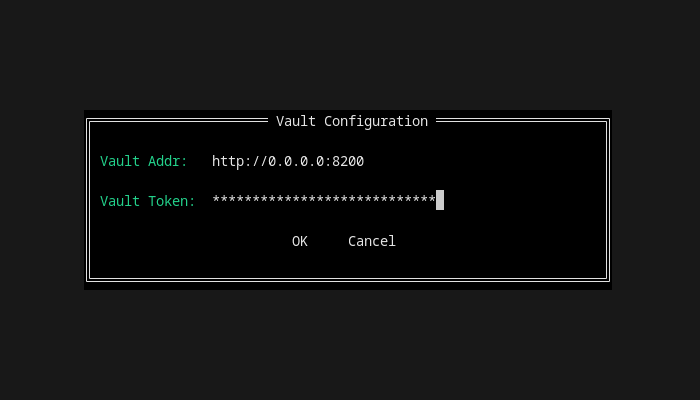
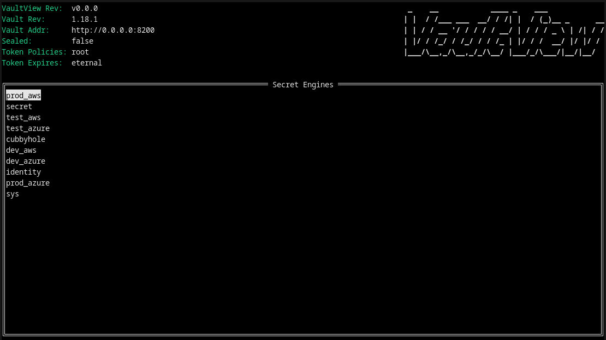
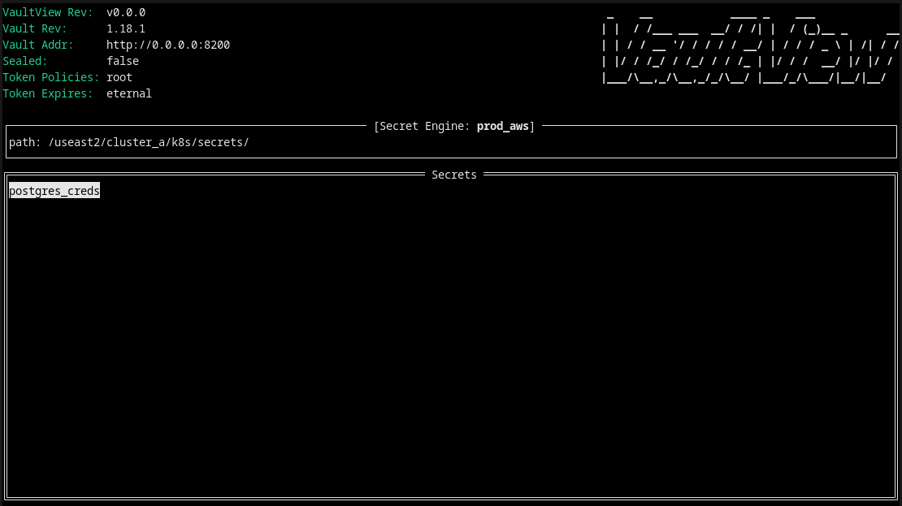
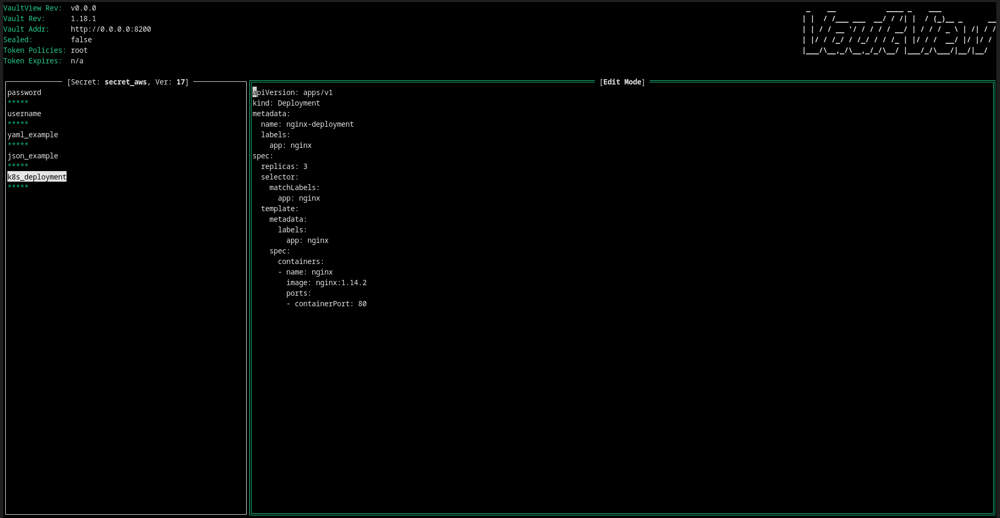

# Vaultview - the way to interact with HashiCorp Vault

Vaultview provide TUI for HashiCorp Vault. It is simple, it is small and similar to k9s (it was inspiration for this project).

Note: vaultview currently supports only kv2 secret engines type

# Screenshoots

### 1. Vault Configuration

### 2. List Secret Engines

### 3. List Secrets within Engine

### 4. Show, copy and edit secret data

# Installation

Vaultview is available for Linux, macOS and Windows platforms. Binaries can be downloaded from [release page](https://github.com/milosveljkovic/vaultview/releases).

# Features

- list all secret engines
- list all secrets in the secret engines
- `Ctrl+R` - hard reload of the secret
- cache secrets
- `<x>` - secret data preview
- `<c>` - copy secret key to clipboard
- `<e>`- edit secret
- `<Tab>`- move through the list

## Todo
- add new secret
- enable new secret engine
- all feature above for policies (+token creations)
- secret sync (remote to local)
